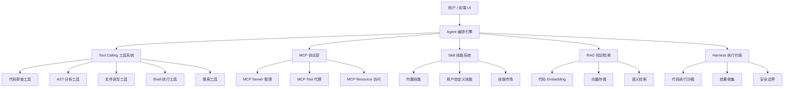

# CodeForge 炼码

**基于多Agent协作的代码智能分析与最佳实践挖掘平台**

  

---

## 项目概述

CodeForge 是一个桌面端 AI Agent 平台，专注于代码领域的智能分析。它对代码仓库进行"数据挖掘"——挖掘代码模式、审查质量、推荐最佳实践、自动修复。

### 与课程"数据挖掘"的关联

| 数据挖掘概念 | CodeForge 中的映射 |
|---|---|
| 数据采集 | 代码仓库扫描、文件解析、AST 提取 |
| 特征工程 | 代码复杂度、重复率、命名规范、依赖关系图 |
| 模式挖掘 | 代码异味检测、反模式识别、最佳实践匹配 |
| 分类/聚类 | 代码质量分级、代码风格分类 |
| 推荐系统 | 最佳实践推荐、重构建议推荐 |
| 知识图谱 | 代码依赖关系图、函数调用图（RAG） |

---

## 核心架构

```
用户 → 前端 UI (React 19 + TypeScript)
         ↓ Tauri IPC (invoke / event)
      Agent 编排引擎 (Rust)
         ├── LLM Provider（OpenAI / Anthropic / DeepSeek / Ollama）
         ├── Tool Calling（12+ 内置工具 + MCP 外部工具）
         ├── Skill 技能系统（SKILL.md 驱动）
         ├── RAG 知识检索（代码 Embedding + 向量搜索）
         ├── Harness 执行约束（权限 + 沙箱 + Token 预算）
         └── Session 会话管理（SQLite 持久化）
```

### 模块总览



---

## Agent 系统

### Agent 运行时内核

#### 执行循环
```
user_message → LLM(messages, tools) → response
  ├─ has tool_calls? → execute_tools → append results → LOOP BACK
  └─ no tool_calls? → emit(response) → END
```

#### 生命周期钩子
```
on_agent_start → on_before_llm_call → on_after_llm_call
  → on_before_tool_exec → on_after_tool_exec → on_agent_end
```

#### Agent 定义
```rust
struct Agent {
    name: String,
    instructions: Option<String>,
    tools: Vec<String>,
    model: String,
    hooks: Option<AgentHooks>,
}
```

#### 指令注入
```
[base_instructions]      ← Agent.instructions
+ [skill_instructions]   ← 启用的 Skill 中的 instructions
+ [context_summary]      ← 压缩后的上下文摘要
+ [tool_descriptions]    ← 当前可用工具的描述
```

#### 权限系统
```
ToolCall → check_permission(tool_name, args)
  ├─ AlwaysAllow → execute
  ├─ AskUser → emit("permission_request") → wait for frontend
  └─ AlwaysDeny → return error
```

### 多 Agent 协作

| Agent 角色 | 职责 | 模型偏好 |
|---|---|---|
| Orchestrator (编排者) | 接收任务，拆解分发给专家 Agent | claude-opus-4-6 / gpt-5.4 |
| Reviewer (审查者) | 代码审查、质量评分、问题定位 | claude-opus-4-6 |
| Refactorer (重构者) | 重构建议、生成修改 patch | claude-sonnet-4-6 |
| Researcher (研究者) | 查找最佳实践、搜索文档规范 | gemini-3.1-pro / gpt-5.4 |
| Executor (执行者) | 沙箱中运行代码、测试 | deepseek-v3.2 / 任意 |

---

## 工具系统

所有工具遵循统一 JSON Schema 定义，兼容 OpenAI Function Calling 格式。

| 工具名 | 描述 | 分类 |
|---|---|---|
| `read_file` | 读取文件内容 | 文件 |
| `write_file` | 写入文件 | 文件 |
| `list_directory` | 列出目录结构 | 文件 |
| `search_code` | 在代码库中搜索 | 搜索 |
| `grep_pattern` | 正则匹配搜索 | 搜索 |
| `run_shell` | 执行 shell 命令 | 执行 |
| `analyze_ast` | AST 语法树分析 | 分析 |
| `check_complexity` | 圈复杂度检测 | 分析 |
| `find_code_smells` | 代码异味检测 | 审查 |
| `suggest_refactor` | 重构建议生成 | 审查 |
| `apply_patch` | 应用代码修改 | 修改 |
| `run_tests` | 运行测试套件 | 执行 |

---

## MCP 协议层

Model Context Protocol — 让 Agent 连接外部服务（Linter、CI/CD、Git 等）。

```
CodeForge App
    └── MCP Client (Rust)
           ├── stdio transport → Local MCP Server (e.g. eslint-mcp)
           └── SSE transport   → Remote MCP Server (e.g. GitHub MCP)
```

---

## Skill 技能系统

Skill = Prompt 模板 + 工具子集 + 可选 MCP Server。

```
skills/
├── code-review/SKILL.md
├── best-practices/SKILL.md
├── security-audit/SKILL.md
├── refactoring/SKILL.md
└── documentation/SKILL.md
```

SKILL.md 定义：`name`、`description`、`instructions`（注入 prompt）、`tools`（可用工具列表）、`mcp_servers`。

---

## RAG 知识检索

对代码仓库建立向量索引，让 Agent 能语义理解代码结构。

1. **代码切分** — 按函数/类/文件切分为 chunk
2. **Embedding** — 调用 Embedding API 生成向量
3. **向量存储** — 本地 SQLite + 余弦相似度
4. **检索** — 用户/Agent 查询时返回相关代码

---

## Harness 执行约束框架

Harness = Agent 运行时的执行纪律框架（概念来自 oh-my-openagent），对 Agent 行为的全面约束：

- **执行规则强制** — Agent 必须按特定工作流执行
- **权限控制** — AlwaysAllow / AskUser / AlwaysDeny
- **执行沙箱** — Shell 命令在隔离进程/临时目录中执行
- **Token 预算** — 单次/全局 token 用量控制（默认 10M）
- **输出格式强制** — Hash-Anchored Editing
- **重试/恢复** — 工具调用失败自动重试
- **上下文压缩** — 超出预算时自动裁剪历史消息

---

## 前端页面

| 页面 | 路由 | 功能 |
|---|---|---|
| 仪表盘 | `/` | 项目概览、Agent 活动、token 用量、快速操作 |
| 对话 | `/chat` | 流式 AI 对话、Markdown 渲染、代码高亮 |
| 代码审查 | `/review` | 一键审查本地/远端仓库，问题列表和修复建议 |
| Agent 管理 | `/agents` | 查看/配置/启停 Agent 角色 |
| 工具注册 | `/tools` | 查看已注册工具，测试工具调用 |
| MCP 服务 | `/mcp` | 添加/管理 MCP Server |
| 技能市场 | `/skills` | 浏览/启用/禁用 Skill |
| 知识库 | `/knowledge` | 代码仓库索引，语义搜索 |
| 模型配置 | `/providers` | 添加 LLM Provider |
| 执行日志 | `/logs` | Agent 执行 trace、token 消耗 |
| 设置 | `/settings` | 全局配置、主题、项目路径 |

---

## 项目结构

```
codeforge/
├── src/                      # React 前端
│   ├── components/           # Sidebar, TopBar, Layout, PermissionDialog
│   ├── pages/                # 11 个功能页面
│   ├── styles/               # CSS 变量系统 (暗色/亮色主题)
│   └── lib/backend.ts        # Tauri IPC 桥接层
├── src-tauri/src/            # Rust 后端
│   ├── llm/                  # LLM Provider (OpenAI/Anthropic)
│   ├── agent/                # Agent Runtime (Loop/Hooks/Prompt)
│   ├── tools/                # 工具系统 (12+ 内置工具)
│   ├── mcp/                  # MCP Client (stdio/SSE)
│   ├── skill/                # SKILL.md 解析加载
│   ├── knowledge/            # RAG (Embedding/向量存储/检索)
│   ├── harness/              # 权限/沙箱/Token预算/压缩
│   ├── session/              # 会话持久化 (SQLite)
│   ├── commands/             # Tauri IPC 命令入口
│   └── db/                   # SQLite 数据层
└── skills/                   # 技能定义
```

---

## 快速开始

```bash
git clone https://github.com/Mag1cFall/CodeForge.git
cd CodeForge
npm install

# 仅前端预览
npm run dev

# 完整桌面应用
cargo tauri dev

# 构建发布包
cargo tauri build
```

### 环境要求

- Node.js >= 18
- Rust >= 1.77
- Windows: 系统自带 WebView2

---

## 技术栈

| 层级 | 技术 |
|---|---|
| 前端 | React 19, TypeScript, Vanilla CSS, lucide-react, react-markdown |
| 桌面框架 | Tauri v2 |
| 后端 | Rust, tokio, reqwest, rusqlite |
| AST 分析 | tree-sitter |

---

## 参考项目

| 项目 | 参考重点 |
|---|---|
| [AstrBot](https://github.com/Soulter/AstrBot) | Agent 运行时、MCP 客户端、工具系统、Skill、知识库 |
| [OpenClaw](https://github.com/openclaw) | Gateway 架构、MCP Server、安全模型 |
| [Claurst](https://github.com/claurst) | Rust 工具定义、权限系统 |
| [OpenCode](https://github.com/opencode) | Agent loop、流式响应 |
| [Oh-My-OpenAgent](https://github.com/nicepkg/oh-my-openagent) | 多 Agent 协作、Harness |
